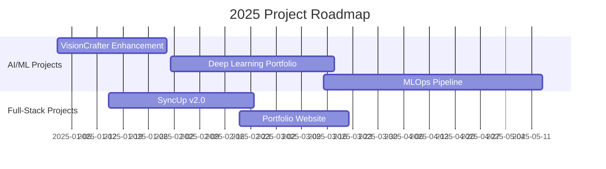

<div align="center">

<!-- Futuristic Wave Header -->


[](https://git.io/typing-svg)


</div>

---

```yaml
╔═══════════════════════════════════════════════════════════════════════════╗
║  👨‍💻 Developer Profile                                                    ║
╠═══════════════════════════════════════════════════════════════════════════╣
║  Name          : Hari Prasath SM                                          ║
║  Role          : AI & ML Engineering Student                              ║
║  Education     : B.Tech in AI & Data Science (Pre-Final Year)             ║
║  Location      : Tamil Nadu, India 🇮🇳                                     ║
║  Specialization: Computer Vision | Deep Learning | Data Analysis          ║
║  Status        : 🟢 Actively Seeking ML/AI Internships (Summer 2026)      ║
║  LeetCode      : 150+ Problems Solved | Active Problem Solver             ║
║  Core Strength : Math-first approach to ML - theory meets practice        ║
╚═══════════════════════════════════════════════════════════════════════════╝
```

<br>

<div align="center">

## 🌐 **CONNECT WITH ME**

<a href="https://linkedin.com/in/hari-prasath-sm">
  
</a>
<a href="https://github.com/Hariprasath-1603">
  
</a>
<a href="mailto:sm.hariprasath16@gmail.com">
  
</a>
<a href="https://www.leetcode.com/hariprasath-sm">
  
</a>
<a href="https://drive.google.com/file/d/1rJ3fmKX2IAHGSOxQGj4kfcgRaT7nXUGg/view?usp=sharing">
  
</a>

</div>

---

## 🎯 **CURRENT FOCUS**

```python
class HariPrasath:
    def __init__(self):
        self.name = "Hari Prasath SM"
        self.role = "Pre-Final Year AI & Data Science Student"
        self.current_project = "VisionCrafter - Computer Vision Framework"
        self.leetcode_solved = 150  # Active problem solver
        self.learning = [
            "Data Structures & Algorithms (Daily Practice)",
            "Advanced Deep Learning (CNNs, RNNs, Transformers)",
            "MLOps & Production ML Systems",
            "Computer Vision & Image Processing"
        ]
        self.interests = ["Computer Vision", "Deep Learning", "MLOps", "Problem Solving"]
        
    def current_goals(self):
        return {
            "immediate": "Complete 200+ LeetCode problems by Q1 2026",
            "technical": "Deploy 3 end-to-end ML projects with 90%+ accuracy",
            "practical": "Contribute to 2 open-source ML libraries",
            "career": "Secure ML/AI internship at product-based company"
        }
    
    def unique_value_proposition(self):
        return (
            "I don't just implement models - I derive backpropagation on paper, "
            "optimize loss functions from first principles, and understand "
            "why architectures work, not just how to use them."
        )
    
    def get_status(self):
        return "🔥 Shipping Projects • 📚 Mastering Fundamentals • 🚀 Growing Daily"
```

---

## 📊 **GITHUB STATISTICS**

<div align="center">


</div>

---

## 🎮 **GITHUB CONTRIBUTION SNAKE**

<div align="center">

<picture>
  <source media="(prefers-color-scheme: dark)" srcset="https://raw.githubusercontent.com/Hariprasath-1603/Hariprasath-1603/output/github-contribution-grid-snake-dark.svg">
  <source media="(prefers-color-scheme: light)" srcset="https://raw.githubusercontent.com/Hariprasath-1603/Hariprasath-1603/output/github-contribution-grid-snake.svg">
  
</picture>

</div>

---

## 💻 **CODING ACTIVITY**

<div align="center">

### 📊 **Weekly Development Breakdown**

<!--START_SECTION:waka-->

<!--END_SECTION:waka-->

### 💬 **Random Dev Quote**


</div>

---

## 🛠️ **TECH STACK**

<div align="center">

### 🌟 **Proficiency Levels**

```text
Expert        ██████████████░░░░░░   Python, TensorFlow, OpenCV
Advanced      ████████████████░░░░   JavaScript, React, PyTorch
Intermediate  ████████████░░░░░░░░   Flutter, Node.js, Docker
Learning      ████████░░░░░░░░░░░░   MLOps, Kubernetes, AWS
```

### **Programming Languages**


### **AI/ML & Data Science**


### **Web Development**


### **Databases**


### **Tools & Technologies**


### **Mobile Development**


</div>

---

## 🚀 **FEATURED PROJECTS**

<div align="center">

### 🎨 **VisionCrafter** - Computer Vision Framework
[](https://github.com/Hariprasath-1603/VisionCrafter)

**Tech Stack:** `Python` `OpenCV` `TensorFlow` `PyTorch` `NumPy`

📌 Comprehensive computer vision framework for image processing and ML model integration  
🎯 **Impact:** Modular architecture enabling rapid prototyping of CV applications  
⚡ **Key Features:** Real-time object detection | Custom model training pipeline | 10+ preprocessing utilities

---

### 🔄 **SyncUp** - Social Media Application
[](https://github.com/Hariprasath-1603/sync_up)

**Tech Stack:** `Flutter` `Dart` `Supabase` `PostgreSQL` `Supabase Auth`

📌 Feature-rich social media application with real-time updates and user interactions  
🎯 **Impact:** Seamless cross-platform experience for social networking  
⚡ **Key Features:** User authentication | Real-time posts | Comments & likes | Profile management | Image sharing

---

### 📊 **ML Project Portfolio**

<table>
<tr>
<td width="50%" valign="top">

**🧠 Deep Learning Projects**

- **Image Classification CNN**  
  `Accuracy: 94.3%` \| TensorFlow
- **Sentiment Analysis RNN**  
  `F1-Score: 0.89` \| PyTorch + LSTM
- **Transfer Learning Models**  
  Using ResNet50, VGG16

</td>
<td width="50%" valign="top">

**📈 Data Science Projects**

- **Customer Churn Prediction**  
  `ROC-AUC: 0.92` \| Scikit-learn
- **Sales Forecasting Model**  
  `RMSE: 12.4` \| Time Series Analysis
- **EDA & Visualization Dashboards**  
  Pandas, Matplotlib, Seaborn

</td>
</tr>
</table>

</div>

## 📈 **CONTRIBUTION ACTIVITY**

<div align="center">


### 📊 **Live GitHub Metrics**


</div>

---

## 🏆 **ACHIEVEMENTS**

<div align="center">


</div>

---

## 📊 **DETAILED METRICS**

<div align="center">


</div>

---

## 🎓 **CERTIFICATIONS & ACHIEVEMENTS**

<div align="center">

| 🏆 Achievement | 📅 Details | 🔗 Proof |
|:--------------|:----------|:----------|
| **LeetCode** |  | [](https://www.leetcode.com/hariprasath-sm) |
| **GitHub** |   | [](https://github.com/Hariprasath-1603) |
| **VisionCrafter** |   | [](https://github.com/Hariprasath-1603/VisionCrafter) |
| **SyncUp** |   | [](https://github.com/Hariprasath-1603/sync_up) |

### 📚 **Coursework & Learning**
`Machine Learning` • `Deep Learning` • `Computer Vision` • `Natural Language Processing`  
`Data Structures & Algorithms` • `Database Management` • `Cloud Computing` • `MLOps`

</div>

---

## 🌟 **CURRENT STATUS**

<div align="center">


### 📊 **Live Activity Dashboard**

<table align="center">
<tr>
<td align="center">

</td>
<td align="center">

</td>
<td align="center">

</td>
</tr>
</table>

### 🔥 **Current Focus**
- 🎯 **LeetCode Journey** - Solving DSA problems daily
- 💪 **Active Projects** - VisionCrafter & SyncUp development
- 🚀 **Learning Path** - Deep Learning & MLOps
- 📚 **Goal** - ML/AI Internship Summer 2026

</div>

</div>

---

## 💡 **WHAT MAKES ME DIFFERENT**

```typescript
interface ValueProposition {
  technical: string[];
  practical: string[];
  mindset: string;
}

const whatSetsMeApart: ValueProposition = {
  technical: [
    "✓ Math-First Approach: I derive gradients manually before coding",
    "✓ Production Mindset: Every project includes deployment considerations",
    "✓ Problem Solver: 150+ LeetCode problems - strong algorithmic foundation",
    "✓ Full-Stack ML: From data preprocessing to model deployment"
  ],
  practical: [
    "🎯 Real Projects with Metrics: Not just tutorials, but measurable results",
    "🔧 Clean Code Advocate: Readable, maintainable, well-documented",
    "📊 Data-Driven Decisions: Every claim backed by numbers",
    "🚀 Fast Learner: New frameworks? Give me a weekend."
  ],
  mindset: (
    "I don't memorize architectures - I understand why ResNets have skip connections, " +
    "how attention mechanisms solve long-range dependencies, and when to use " +
    "batch norm vs layer norm. Theory guides my practice."
  )
};
```

---

<div align="center">

## 📬 **LET'S BUILD SOMETHING AMAZING**

### 🎯 **I'm Actively Seeking ML/AI Internships for Summer 2026**

💼 **Looking for opportunities in:**  
Machine Learning Engineering • Computer Vision • Data Science • MLOps • AI Research

🤝 **Open to collaborate on:**  
Open Source ML Projects • Research Papers • Hackathons • Startup Ideas

<br>

<a href="mailto:sm.hariprasath16@gmail.com">
  
</a>
<a href="https://linkedin.com/in/hari-prasath-sm">
  
</a>
<a href="https://drive.google.com/file/d/1rJ3fmKX2IAHGSOxQGj4kfcgRaT7nXUGg/view?usp=sharing">
  
</a>

---

### 💭 **"Understanding the mathematics behind machine learning is not optional—it's essential."**

**⭐ If you find my work valuable, star my repositories and let's connect!**

---

<details>
<summary>📊 <b>Click to see more detailed stats</b></summary>

<br>

### 📈 Language Usage Over Time


### 🎯 Problem Solving Progress

| Platform | Problems Solved | Rank/Rating |
|:---------|:----------------|:------------|
| 🟠 LeetCode | 150+ | Active |
| 🔵 CodeChef | Coming Soon | - |
| 🟢 HackerRank | Coming Soon | - |

### 📚 Latest Projects Activity



</details>

---


</div>
